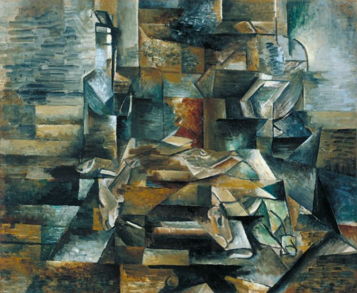
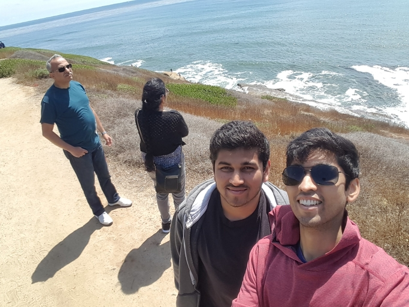
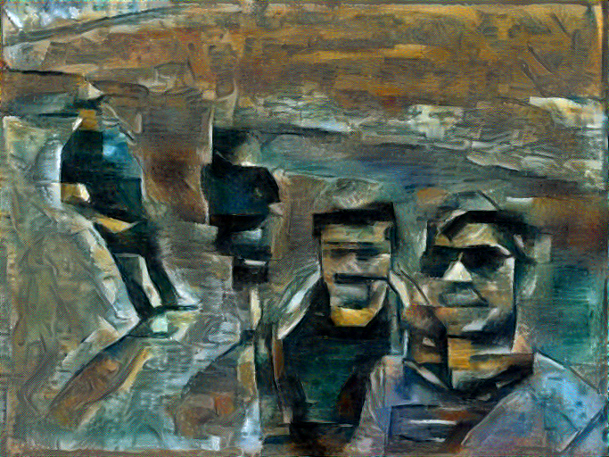
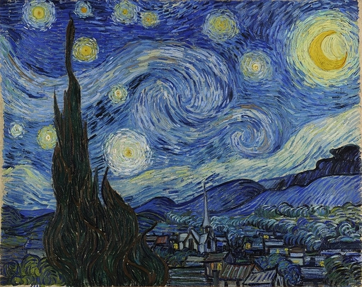
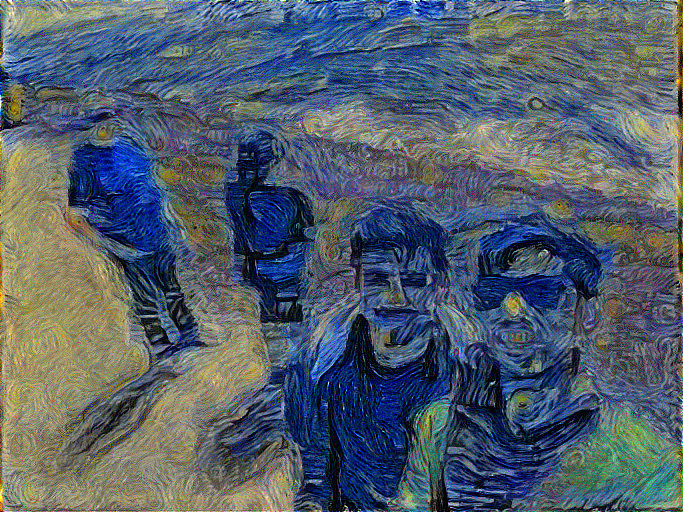

# Style Transfer

Basic style transfer implementation based on TensorFlow 2.0 and Keras.

Configurable to run on both vgg16 and vgg19 networks, as well as with any loss weight ratios (passed in via command line arguments).

The conda environment used for development is included in [environment.yml](environment.yml) for ease of use. Note that all of the libraries may not be necessary, and a more concise environment file may be uploaded later.


## Usage

To run style transfer, run `python style.py` with the appropriate arguments, as listed below:

```
usage: style.py [-h] --content CONTENT --style STYLE --outdir OUTDIR --iters
                ITERS [--interval INTERVAL] [--model {vgg19,vgg16}]
                [--csratio CSRATIO] [--varloss VARLOSS]

Style Transfer

optional arguments:
  -h, --help            show this help message and exit
  --content CONTENT     Content image.
  --style STYLE         Style image.
  --outdir OUTDIR       Output directory for generated images.
  --iters ITERS         Number of iterations to run.
  --interval INTERVAL   Iteration interval when image checkpoints should be
                        saved. Ex: a value of 1 saves an image at every
                        iteration.
  --model {vgg19,vgg16}
                        Pretrained model to use during generation. Select
                        from: vgg19, vgg16
  --csratio CSRATIO     The ratio of loss weights, =content/style
  --varloss VARLOSS     The weight to place on the total variation loss (on
                        high frequency artifacts).
```


## Examples

The following are a few examples of a family photo styled with the vgg16 network with hyperparameters determined through qualitative experimentation for each content/style image pair.

| Style | Content | Generated |
| ----- | ------- | ----------|
|  |  |  |
|  |  |  |


Some of the generation/styling processes themselves are included below:

<table>
  <tr>
    <td>
      
    </td>
    <td>
      
    </td>
  </tr>
</table>


## Inspired By
- [*A Neural Algorithm of Style* by Gatys et al](https://arxiv.org/abs/1508.06576)
- [TensorFlow Neural Style Transfer Tutorial](https://www.tensorflow.org/tutorials/generative/style_transfer)
